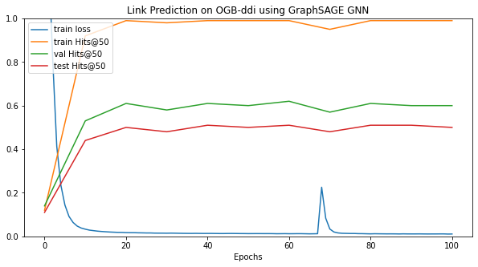

# Link Prediction

[TOC]

## Link Prediction on ogbl-ddi dataset

The [ogbl-ddi dataset](https://ogb.stanford.edu/docs/linkprop/#ogbl-ddi) is a small. homogenous, feature-less, undirected graph, each node represents a drug. Edges between nodes represent interactions between the drugs, where the joint effect of taking both drugs is markedly different than the expected effects if either drug was taken independently.

| Name     | #nodes | #edges    | #features | **Metric** |
| -------- | ------ | --------- | --------- | ---------- |
| ogbl-ddi | 4,267  | 1,334,889 | 0         | Hits@20    |

The model that computes the node embeddings use `SAGEConv` convolution from the pytorch geometric library and can be tuned using different configuration of parameters:

- hidden dimension
- number of layers
- dropout probability
- if apply or not skip connection between convolution layers
- if apply a post processing MLP

The previous model is trained alongside a LinkPredictor that takes the embedding vector of 2 nodes $(h_i, h_j \in \mathbb{R}^d )$ and computes the probability score of whether there exists a link between the 2 nodes with the rule: $P = MLP(h_i \odot h_j)$ where  $x \odot y$ is the element-wise product (Hadamard product).

The model is trained by jointly maximizing the probability prediction of correct edges and minimizing the probability prediction of the incorrect edges using negative sampling. The loss is defined as:
$$
Loss = -\log(prob\_pos\_edges + ϵ) - \log(1-prob\_neg\_edges + ϵ)
$$
where the $ϵ=10^{-15}$ is added to each term for numerical stability.

The evaluation is performed through the metric $Hits@K =$ Fraction of correct links in the top $K$ links (with respect to their scores).

At the end of the training best model achieves $\approx$ **40%** of $Hits@20$ on test set.

## Link Prediction on ogbl-collab dataset

The [ogbl-collab dataset](https://ogb.stanford.edu/docs/linkprop/#ogbl-collab) is still a relatively small  graph representing a subset of the collaboration network between authors indexed by MAG. Each node represents an author and edges indicate the collaboration between authors. All nodes come with 128-dimensional features, obtained by averaging the word embeddings of papers that are published by the authors. All edges are associated with two meta-information: the year and the edge weight, representing the number of co-authored papers published in that year. The graph can be viewed as a dynamic multi-graph since there can be multiple edges between two nodes if they collaborate in more than one year.

| Name        | #nodes  | #edges    | #features | **Metric** |
| ----------- | ------- | --------- | --------- | ---------- |
| ogbl-collab | 235,868 | 1,285,465 | 128       | Hits@50    |

The model that computes the node embeddings use `SAGEConv` convolution from the pytorch geometric library and can be tuned using different configuration of parameters (same as the one before).

 Since this dataset contain a lot more edges we menage to convert it to a SparseTensor to reduce memory overhead. We also try to use minibatches samples using NeighborSampler dataloader.

At the end of the training best model achieves $\approx$ **50%** of $Hits@50$ on test set.

## Link Prediction on ogbl-ppa dataset

The [ogbl-ppa dataset](https://ogb.stanford.edu/docs/linkprop/#ogbl-ppa) is an undirected, unweighted graph. Nodes represent proteins from 58 different species, and edges indicate biologically meaningful associations between proteins, e.g., physical interactions, co-expression, homology or genomic neighborhood. We provide a graph object constructed from training edges (no validation and test edges are contained). Each node contains a 58-dimensional one-hot feature vector that indicates the species that the corresponding protein comes from.

| Name     | #nodes  | #edges     | #features | **Metric** |
| -------- | ------- | ---------- | --------- | ---------- |
| ogbl-ppa | 576,289 | 30,326,273 | 58        | Hits@100   |

 Since this dataset contain a lot more edges we menage to convert it to a SparseTensor to reduce memory overhead.

At the end of the training best model achieves $\approx$ **30%** of $Hits@100$ on test set.

