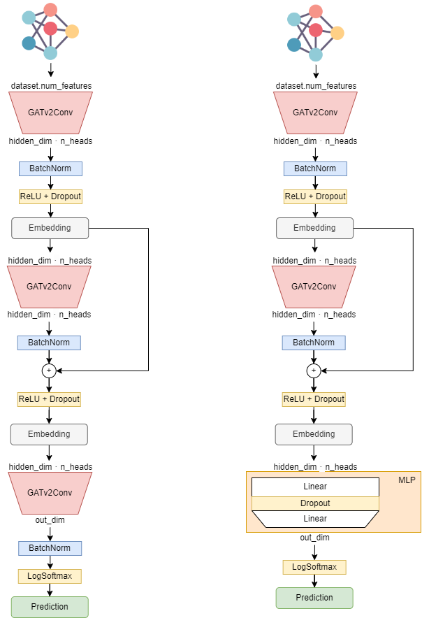
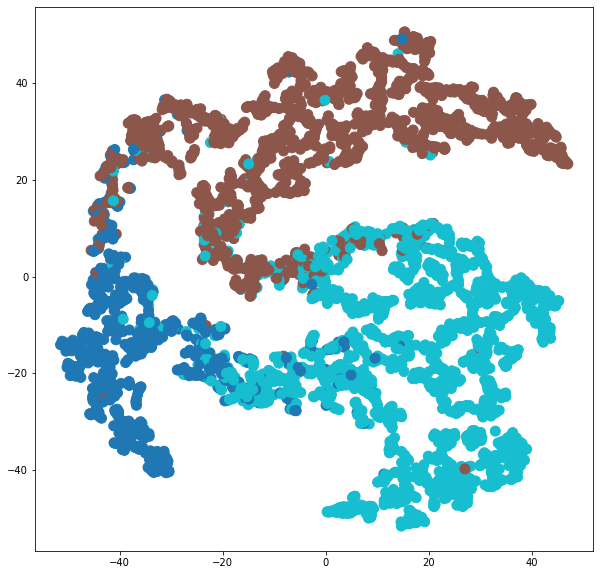

# Node Classification

[TOC]

## Graph Node Classification

Set of experiments about Graph Node Classification on [Cora Dataset](https://pytorch-geometric.readthedocs.io/en/latest/modules/datasets.html#torch_geometric.datasets.Planetoid) (full).

| Name | #nodes | #edges | #features | **#classes** |
| ---- | ------ | ------ | --------- | ------------ |
| Cora | 2,708  | 10,556 | 1,433     | 7            |

*Experiment #1 - GCN*:

Implementation of a [Graph Convolution Layer](https://pytorch-geometric.readthedocs.io/en/latest/notes/create_gnn.html#id2) based on [Message Passing](https://pytorch-geometric.readthedocs.io/en/latest/modules/nn.html#MessagePassing). The model structure is inspired on [SSP](https://paperswithcode.com/paper/optimization-of-graph-neural-networks-with) that obtain the SOTA in Node Classification on this dataset. Achieved **86%** accuracy on test set.

*Experiment #2- SAGE:*

Implementation of convolution layer based on [GraphSAGE](https://arxiv.org/abs/1706.02216). The model is pretty straightforward and follows the structure of the one in the previous experiment: one convolution followed by a ReLU activation and dropout layer and then another convolution followed by a log_softmax activation.
Also this model achieves **86%** accuracy on test set but seems to better separate embeddings.

TO-DO: used only mean aggregation, try also LSTM and Pool (max)

*Experiment #3- GAT:*

Use of the [Graph Attention (v2)](https://pytorch-geometric.readthedocs.io/en/latest/modules/nn.html#torch_geometric.nn.conv.GATv2Conv) from the pytorch geometric library and inspired by the following two papers:

- [Graph Attention Networks](https://arxiv.org/abs/1710.10903)
- [How Attentive are Graph Attention Networks?](https://arxiv.org/abs/2105.14491)

Which ensure better performance wrt the previous defined models is certain tasks and more robustness to noise. Maybe this is not the case because also with this dataset the model retrieve **86%** of accuracy on test set even if beats the previous ones with peaks at 88-89% on validation phase.The embeddings are not so good as the ones of graphSAGE.

All the trainings has been performed using Adam optimizer, Negative Log Likelihood loss and Early Stopping to avoid the model to overfit on training set. The training is repeated for 10 trials with at most 100 epochs and the best model among trials is evaluated on test set.

Below, an extract of the progress of how the model learn to embed classes (downscaled in 2D using [TSNE](https://scikit-learn.org/stable/modules/generated/sklearn.manifold.TSNE.html) algorithm):

## Parametrized GAT Model and node classification on PubMed dataset

Implementation of a model that uses as convolution [Graph Attention (v2)](https://pytorch-geometric.readthedocs.io/en/latest/modules/nn.html#torch_geometric.nn.conv.GATv2Conv) from the pytorch geometric library and can be tuned using different configuration of parameters:

- hidden dimension
- number of layers
- number of attention heads
- dropout probability
- if apply or not skip connection between convolution layers
- if apply or not a post-processing MLP

After each convolution batch normalization is applied to help the network learn faster especially for large graphs.

Below two examples of the resulting network structure: on the left a 3-layer GNN with skip-connection and on the right a 2-layer GNN with post processing MLP

In order to make the training feasible also for large dataset [NeighborLoader](https://pytorch-geometric.readthedocs.io/en/latest/modules/loader.html#torch_geometric.loader.NeighborLoader) has been used to craft batches.

The model has been trained on [PubMed Dataset](https://pytorch-geometric.readthedocs.io/en/latest/modules/datasets.html#torch_geometric.datasets.Planetoid) (full)

| Name   | #nodes | #edges | #features | **#classes** |
| ------ | ------ | ------ | --------- | ------------ |
| PubMed | 19,717 | 88,648 | 500       | 3            |

Dataset node features have been enriched with features constructed based on the topology of the graph: pagerank, louvain partitions, clustering coefficients, betweenness centrality and degree.

The training method is performed for each combination of parameter chosen for N trials. A the end of each train the best model among each trial and configuration is chosen based on the accuracy obtained on the test set. 

At the end the best GNN model achieved **90.90%** of accuracy on the test set. Below, an example of final embedding of test nodes(downscaled in 2D using [TSNE](https://scikit-learn.org/stable/modules/generated/sklearn.manifold.TSNE.html) algorithm):

Also performance over some ML models trained using cross-validation and grid-search to seek best configuration of parameters on train set scores have been evaluated . Below have been reported the accuracy achieved on test set:

- Logistic Regressor: **83.28%**
- Random Forest: **91.25%**
- XGBoost: **90.53%**

For this dataset also ML models achieve very good performances, especially random forest that overtake GNN (with topology features). We further investigate on the reasons why this happens.

Looking at the predominante features extracted from the Random Forest classifier it seems  like there are no predominant features.

Performing PCA on train dataset instead we discover that topology features encapsulate most of the class information. By the way It seems like the topology only (without other features): performing the label propagation algorithm in fact, considering only topology gives 72% of accuracy.

## Node classification on large datasets with GraphSAINTSampler, ClusterLoader or NeighborLoader

Slightly different version of the Parametrized GAT model descripted in the section above that includes also a method `inference` that computes the embedding representation layer by layer for each batch instead of computing it along the entire convolutions stack. Also batch loaders such as GraphSAINTSampler, ClusterLoader and NeighborLoader are used in order to train on batches instead of work on the entire graph.

In this way it can be used also on larger graphs such as:

| Name           | #nodes    | #edges      | #features | **#classes** |
| -------------- | --------- | ----------- | --------- | ------------ |
| Flickr         | 89,250    | 899,756     | 500       | 7            |
| Reddit2        | 232,965   | 23,213,838  | 602       | 41           |
| AmazonProducts | 1,569,960 | 264,339,468 | 200       | 107          |

## Node classification on ogbn-products using NeighborSampler

Tested the previous described model on the ogbn Amazon products dataset using NeighorSampler in order to craft batches.

| Name          | #nodes    | #edges     | #features | **#classes** |
| ------------- | --------- | ---------- | --------- | ------------ |
| ogbn-products | 2,449,029 | 61,859,140 | 100       | 47           |
