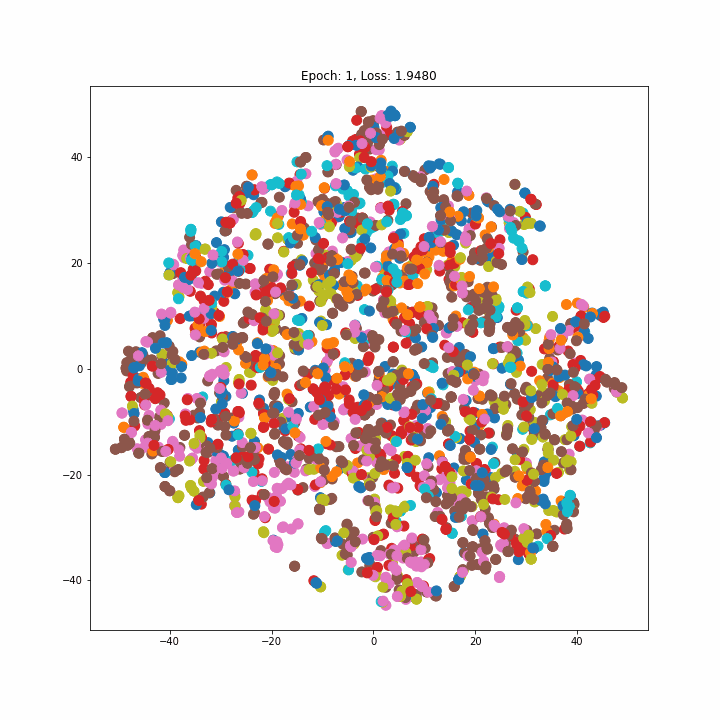

## Graph Node Classification

Set of experiments about Graph Node Classification on [Cora Dataset](https://pytorch-geometric.readthedocs.io/en/latest/modules/datasets.html#torch_geometric.datasets.Planetoid) (full).

*Experiment #1*:

Implementation of a [Graph Convolution Layer](https://pytorch-geometric.readthedocs.io/en/latest/notes/create_gnn.html#id2) based on [Message Passing](https://pytorch-geometric.readthedocs.io/en/latest/modules/nn.html#MessagePassing). The model structure is inspired on [SSP](https://paperswithcode.com/paper/optimization-of-graph-neural-networks-with) that obtain the SOTA in Node Classification on this dataset. Achieved **86%** accuracy on test set.

*Experiment #2:*

Implementation of convolution layer based on [GraphSAGE](https://arxiv.org/abs/1706.02216). The model is pretty straightforward and follows the structure of the one in the previous experiment: one convolution followed by a ReLU activation and dropout layer and then another convolution followed by a log_softmax activation.
Also this model achieves **86%** accuracy on test set but seems to better separate embeddings.

TO-DO: used only mean aggregation, try also LSTM and Pool (max)

*Experiment #3:*

Use of the [Graph Attention (v2)](https://pytorch-geometric.readthedocs.io/en/latest/modules/nn.html#torch_geometric.nn.conv.GATv2Conv) from the pytorch geometric library and inspired by the following two papers:

- [Graph Attention Networks](https://arxiv.org/abs/1710.10903)
- [How Attentive are Graph Attention Networks?](https://arxiv.org/abs/2105.14491)

Which ensure better performance wrt the previous defined models is certain tasks and more robustness to noise. Maybe this is not the case because also with this dataset the model retrieve **86%** of accuracy on test set even if beats the previous ones with peaks at 88-89% on validation phase.The embeddings are not so good as the ones of graphSAGE.

All the trainings has been performed using Adam optimizer, Negative Log Likelihood loss and Early Stopping to avoid the model to overfit on training set. The training is repeated for 10 trials with at most 100 epochs and the best model among trials is evaluated on test set.

Below, an extract of the progress of how the model learn to embed classes (downscaled in 2D using [TSNE](https://scikit-learn.org/stable/modules/generated/sklearn.manifold.TSNE.html) algorithm):

