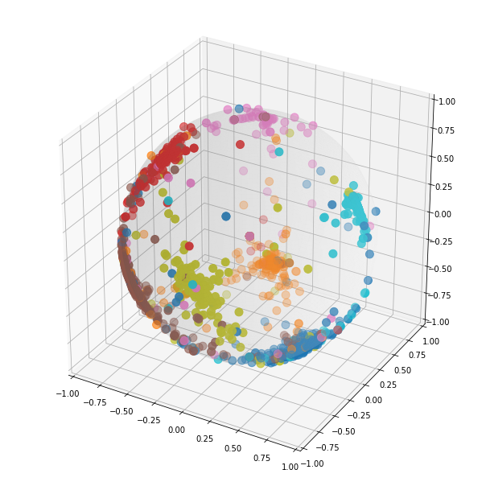

Graph Node Classification on [Cora Dataset](https://pytorch-geometric.readthedocs.io/en/latest/modules/datasets.html#torch_geometric.datasets.Planetoid) 

I defined a Graph Convolution Layer based on [Message Passing](https://pytorch-geometric.readthedocs.io/en/latest/modules/nn.html#MessagePassing).

The model structure is inspired on [SSP](https://paperswithcode.com/paper/optimization-of-graph-neural-networks-with) that obtain the SOTA in Node Classification on this dataset.

I slightly modified it using the [Large Margin Softmax Loss](https://arxiv.org/abs/1612.02295) instead of the CrossEntropy Loss

First results are promising:

