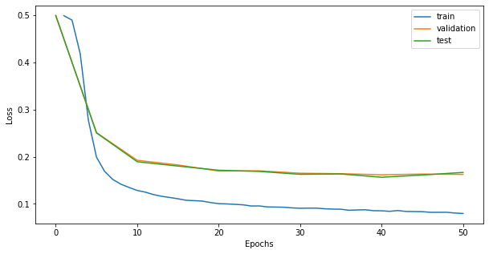
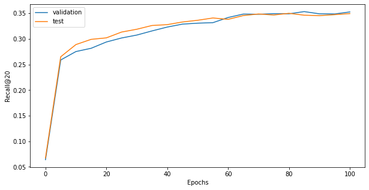
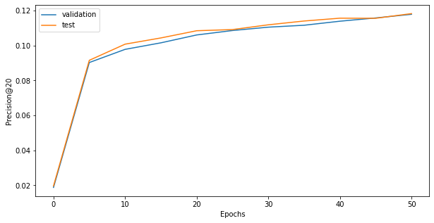

# Recommendation Systems

[TOC]

## Movie Recommendation with LightGCN

Test recommendation of movies to users using two datasets by MovieLens:

| Dataset         | Ratings | Movies | Users |
| --------------- | ------- | ------ | ----- |
| ml-latest-small | 100836  | 9742   | 610   |
| ml-100k         | 100000  | 1682   | 943   |

LightGCN has bees used as base convolution for the good results it allows to achieve compared to other models such as Neural Graph Collaborative Filtering (as showed in [this article]([Recommender Systems with GNNs in PyG | by Derrick Li | Stanford CS224W GraphML Tutorials | Medium](https://medium.com/stanford-cs224w/recommender-systems-with-gnns-in-pyg-d8301178e377)) by Standord CS224W course project) .

Moreover, LightGCN allows to train on big graphs for many iterations in a short time since the only learnable parameters are the embedding for users and items (movies)

The model is parametrized, as the other ones of this projects, allowing to run different type of configuration such as using skip-connections or post-processing MLP. The embeddings for users and items are obtained combining the embeddings obtained at each layer of propagation:

$$e_u = \sum_{k = 0}^K \alpha_k e_u^{(k)} \quad e_i = \sum_{k = 0}^K \alpha_k e_i^{(k)}$$

$\alpha_k$: hyper-parameter which weights the contribution of the $k$-th layer embedding to the final embedding set to $\frac{1}{K}$ which states for the mean.

The model prediction is obtained by taking the inner product of the final user and item embeddings.

$$\hat{y}_{ui} = e_ue_i^\top$$

The training loss is the Bayesian Personalized Ranking (BPR) loss:

$$L_{BPR} = -\sum_{u = 1}^M \sum_{i \in \mathcal{N}_u} \sum_{j \notin \mathcal{N}_u} \ln{\sigma(\hat{y}_{ui} - \hat{y}_{uj})} + \lambda ||E^{(0)}||^2$$

with:

- $\hat{y}_{ui}$: predicted score of a positive sample
- $\hat{y}_{uj}$: predicted score of a negative sample
- $\lambda$: hyper-parameter which controls the L2 regularization strength

The evaluation metrics considered are $recall@K$ and $precision@K$.

The training has been performed on ${1.000}$ epochs testing different model configurations obtaining top scores of $\approx 35\%$ of $recall@20$ and $\approx 12\%$ of $precision@20$.

TO-DO:

- test on larger datasets
- compare ML models
