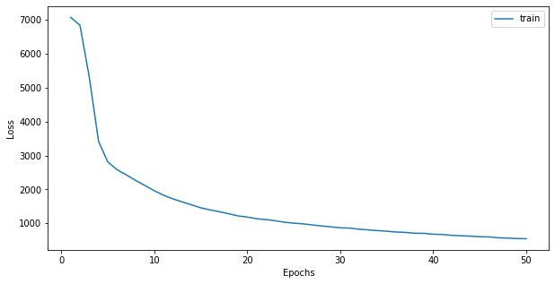

# Recommendation Systems

[TOC]

## Movie Recommendation with LightGCN

Recommendation of movies to users using two datasets by MovieLens:

| Dataset | Ratings   | Movies | Users |
| ------- | --------- | ------ | ----- |
| ml-100k | 100.000   | 1682   | 943   |
| ml-1M   | 1.000.000 | 3596   | 6039  |

We compare the performance of graph-based method such as LightGCN and Neural Graph Collaborative Filtering against LightFM  as the current SOTA used in many companies.

We demonstrate the advantage of using GNNs that, via message passing, are capable to better encode user-item interaction in the embeddings.

The model is parametrized, allowing to run different type of configuration such as using skip-connections or post-processing MLP. The embeddings for users and items are obtained combining the embeddings obtained at each layer of propagation:

$$e_u = \sum_{k = 0}^K \alpha_k e_u^{(k)} \quad e_i = \sum_{k = 0}^K \alpha_k e_i^{(k)}$$

$\alpha_k$: hyper-parameter which weights the contribution of the $k$-th layer embedding to the final embedding set to $\frac{1}{K}$ which states for the mean.

The model prediction is obtained by taking the inner product of the final user and item embeddings.

$$\hat{y}_{ui} = e_ue_i^\top$$

The training loss is the Bayesian Personalized Ranking (BPR) loss:

$$L_{BPR} = -\sum_{u = 1}^M \sum_{i \in \mathcal{N}_u} \sum_{j \notin \mathcal{N}_u} \ln{\sigma(\hat{y}_{ui} - \hat{y}_{uj})} + \lambda ||E^{(0)}||^2$$

with:

- $\hat{y}_{ui}$: predicted score of a positive sample
- $\hat{y}_{uj}$: predicted score of a negative sample
- $\lambda$: hyper-parameter which controls the L2 regularization strength

The evaluation metrics considered are $recall@K$ and $precision@K$.

**LightGCN** on MovieLens1M

The training has been performed on $50$ epochs testing different model configurations obtaining top scores of $\approx 25\%$ of $recall@20$ and $\approx 9.5\%$ of $precision@20$.

**NGCF** on MovieLens1M

The training has been performed on $50$ epochs testing different model configurations obtaining top scores of $\approx 24\%$ of $recall@20$ and $\approx 9\%$ of $precision@20$.

**LightFM** on MovieLens1M

The training has been performed on $500$ epochs both with or without user/item features and using BPR and warp losses obtaining best scores of of $\approx 20\%$ of $recall@20$ and $\approx 8.5\%$ of $precision@20$. using features and warp loss.

